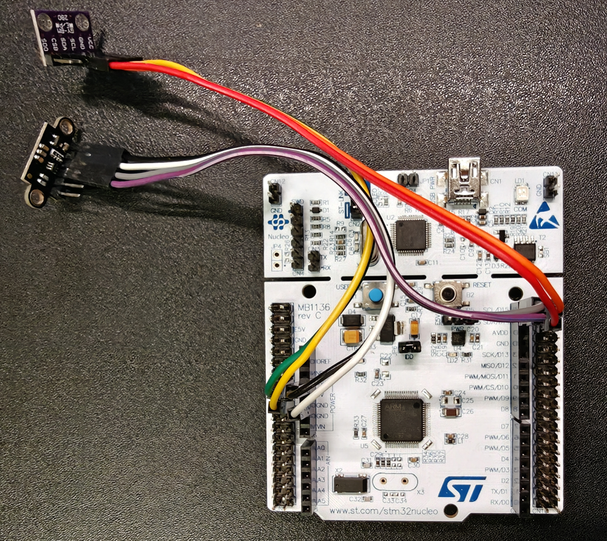
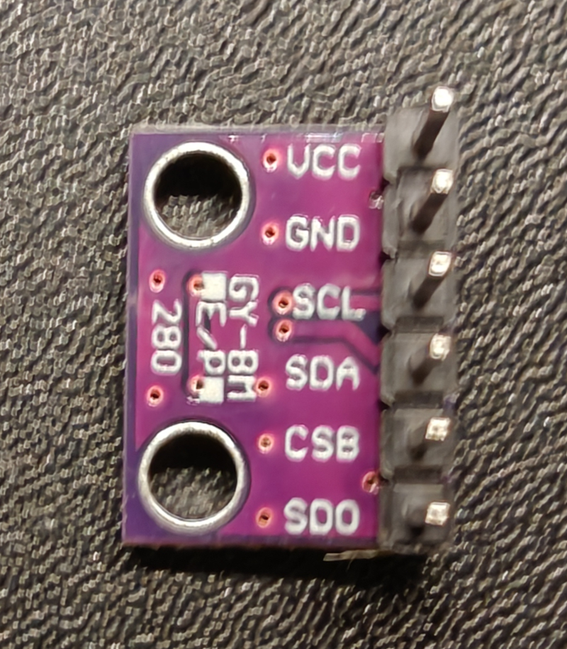
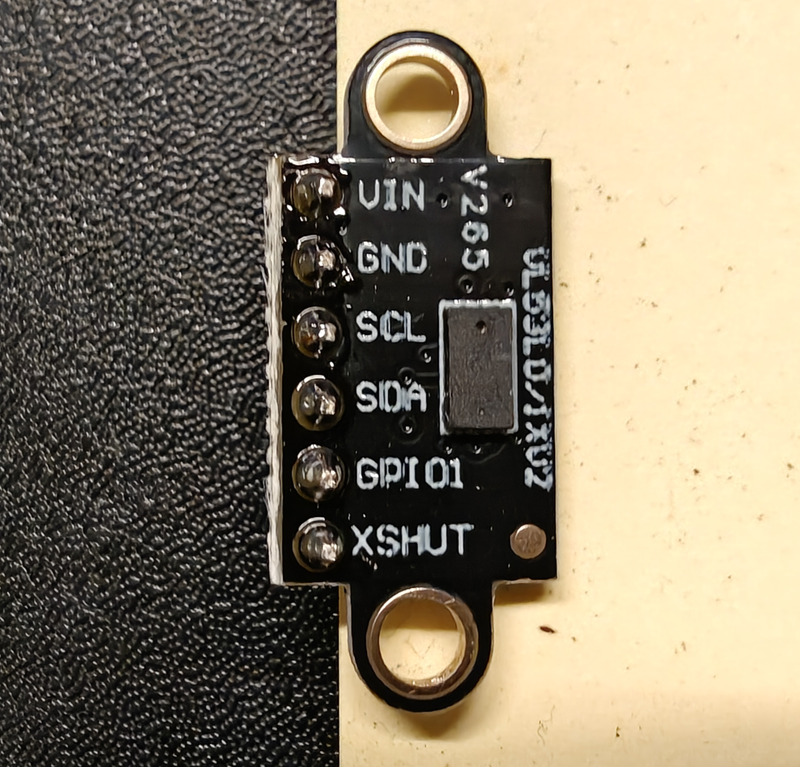

# ic-stm32f4-sensor-demo

**README Languages:**  
[English](https://github.com/kisse04/ic-stm32f4-sensor-demo/blob/main/readme.md) | [中文說明](https://github.com/kisse04/ic-stm32f4-sensor-demo/blob/main/readme_zh-TW.md)

Last updated: 2026-03-01

STM32F446RE (NUCLEO-F446RE) + BMP280 temperature sensor + VL53L0X ToF distance sensor demo.
This project demonstrates how to read multiple sensors over I2C and output logs through UART.

---

## 1. Project Goals

- Integrate two I2C sensors on STM32F4 Nucleo:
  - BMP280: temperature / pressure (this project currently demonstrates temperature reading)
  - VL53L0X: ToF distance measurement
- Provide a consistent `ic_`-prefixed driver API for future extension and portability.
- Demonstrate:
  - Multi-device I2C bus usage
  - UART logging abstraction (`ic_logger`)
  - Layered architecture: App / Drivers / HAL

---

## 2. Hardware Setup

- Board: NUCLEO-F446RE
- Sensors:
  - BMP280 module (3.3V)
  - VL53L0X module (3.3V)
- Interfaces:
  - I2C1: shared bus for BMP280 + VL53L0X
  - USART2: ST-LINK Virtual COM Port to PC (PuTTY/TeraTerm)
- Key wiring:
  - SCL/SDA pins (PB8/PB9, D15/D14)
  - VCC / GND pins

Hardware photos:

Board setup (NUCLEO-F446RE)



BMP280 module



VL53L0X module



---

## 3. Software Architecture

This project follows a four-layer embedded software architecture commonly used in MCU platforms.

### 3.1 Application Layer (`ic_app`)

Implements demo behavior and high-level logic.  
This layer does not access hardware directly; it depends on service modules.

- Main APIs:
  - `ic_app_init()`: initialize LED + sensors with retry and event-flag synchronization.
  - `ic_app_led_task()`: LED blinking task (default 500 ms, stops after 20 cycles).
  - `ic_app_tof_task()`: VL53L0X ranging task (default 250 ms).
  - `ic_app_temp_task()`: BMP280 temperature task (default 1000 ms).
- Task behavior is configurable via `ic_*_task_cfg_t` (`max_count = 0` means run indefinitely).
- Responsibility: application state machine, demo logic, and sensor/LED orchestration.

### 3.2 OSAL Layer (FreeRTOS / CMSIS-RTOS v2)

Provides OS primitives abstracted from the application and service layers.

- Main implementation: `Core/Src/freertos.c`
- Capabilities:
  - Task creation and scheduler startup
  - Event flags: `g_app_init_done`, `g_app_error_flags`
  - Synchronization primitives
  - I2C mutex (`i2cMutexHandle`)
  - Logger queue (`g_log_queue`) + logger task (`ic_log_task`)
  - RTOS backend: FreeRTOS through CMSIS-RTOS v2 wrapper
- FreeRTOS source location: `Middlewares/Third_Party/FreeRTOS`
- Responsibility: threading, synchronization, messaging, and a unified OS interface.

### 3.3 Service Layer (Reusable Functional Modules)

Contains hardware-independent logic above the HAL.

- Modules:
  - `ic_bmp280`: BMP280 temperature driver
  - `ic_vl53l0x`: VL53L0X ToF driver
  - `ic_led`: LED control (logical LED API)
  - `ic_logger`: UART-based logging service
  - `ic_status`: unified status codes and category helpers
- These modules use HAL APIs (I2C/UART/GPIO) but expose clean device-level interfaces to upper layers.
- Responsibility: reusable sensor drivers, error handling, logging, and device abstraction.

### 3.4 BSP / HAL Layer (CubeMX-Generated Board Support)

Lowest layer tied to the STM32F446RE Nucleo board.

- GPIO / I2C / USART initialization
- Clock tree, system startup, and interrupt setup
- CubeMX-generated hardware configuration (`MX_GPIO_Init`, `MX_I2C1_Init`, etc.)
- Locations: `Core/Src`, `Core/Inc`, `Drivers/STM32F4xx_HAL_Driver`
- Responsibility: board-specific initialization, HAL peripheral access, and low-level hardware setup.

Simplified architecture:

```text
      +----------------------------------+
      | Application Layer (`ic_app`)     |
      | - ic_app_init()                  |
      | - ic_app_led_task()              |
      | - ic_app_tof_task()              |
      | - ic_app_temp_task()             |
      +----------------+-----------------+
                       |
      +----------------v-----------------+
      | Service Layer                    |
      | - ic_bmp280                      |
      | - ic_vl53l0x                     |
      | - ic_led                         |
      | - ic_logger                      |
      | - ic_status                      |
      +------+--------------+------------+
             |              |
             | uses OSAL    | uses HAL APIs (I2C/UART/GPIO)
             v              v
      +----------------+    +------------------------------+
      | OSAL Layer     |    | BSP / HAL Layer              |
      | (FreeRTOS /    |    | (CubeMX-generated)           |
      |  CMSIS-RTOS v2)|    | - MX_GPIO_Init               |
      | - tasks/sched  |    | - MX_I2C1_Init               |
      | - event flags  |    | - MX_USART2_UART_Init        |
      | - mutex/queue  |    | - Core/Src Core/Inc Drivers  |
      +--------+-------+    +---------------+--------------+
               |                            |
               +------------+---------------+
                            v
                 +-------------------------+
                 | Hardware Peripherals    |
                 | GPIO / I2C1 / USART2    |
                 +-------------------------+
```

### 3.5 Wiring (Readable Version)

1. Shared I2C bus (both sensors on same bus)
   - SCL: `D15 (PB8)`
   - SDA: `D14 (PB9)`
2. Connect BMP280 (3.3V)
3. Connect VL53L0X (3.3V)

BMP280 wiring map

| BMP280 pin | NUCLEO header | NUCLEO pin | Function |
| --- | --- | --- | --- |
| VCC | CN8 Pin 4 | +3V3 | 3.3V power |
| GND | CN8 Pin 6 | GND | Ground |
| SCL | CN5 Pin 10 | D15 (PB8) | I2C1 clock |
| SDA | CN5 Pin 9 | D14 (PB9) | I2C1 data |

VL53L0X wiring map

| VL53L0X pin | NUCLEO header | NUCLEO pin | Function |
| --- | --- | --- | --- |
| VCC | CN7 Pin 16 | +3V3 | 3.3V power |
| GND | CN7 Pin 20 | GND | Ground |
| SCL | CN10 Pin 3 | D15 (PB8) | I2C1 clock (shared) |
| SDA | CN10 Pin 5 | D14 (PB9) | I2C1 data (shared) |

I2C address table

| Sensor | I2C address | Note |
| --- | --- | --- |
| BMP280 | `0x76` | When SDO is connected to GND |
| VL53L0X | `0x29` | Default address |

---

## 4. Project Directory Structure

```text
Core/
  Inc/
    main.h
    gpio.h
    i2c.h
    usart.h
    stm32f4xx_hal_conf.h
    stm32f4xx_it.h

  Src/
    main.c
    freertos.c
    gpio.c
    i2c.c
    usart.c
    stm32f4xx_hal_msp.c
    stm32f4xx_it.c
    system_stm32f4xx.c
    syscalls.c
    sysmem.c

  app/
    Inc/
      ic_app.h         # App entry
      ic_bmp280.h      # BMP280 driver API
      ic_led.h         # LED control API
      ic_logger.h      # logger API (log level, printf)
      ic_status.h      # status code helpers
      ic_vl53l0x.h     # VL53L0X driver API

    Src/
      ic_app.c
      ic_bmp280.c
      ic_led.c
      ic_logger_uart.c
      ic_status.c
      ic_vl53l0x.c

Middlewares/
  Third_Party/
    FreeRTOS/
      Source/
        CMSIS_RTOS_V2/
        include/
        portable/
```

---

## 5. Key Modules

### 5.1 ic_app

```c
void ic_app_init(void);
void ic_app_led_task(void *argument);
void ic_app_tof_task(void *argument);
void ic_app_temp_task(void *argument);
```

- `ic_app_init()`
  - Initializes LED
  - Initializes BMP280 / VL53L0X (up to `IC_APP_INIT_MAX_RETRIES` retries per sensor)
  - Sets error bits on persistent failure (`IC_APP_BMP280_FAIL_BIT` / `IC_APP_VL53L0X_FAIL_BIT`)
  - Runs I2C scan only when `IC_DEBUG_I2C_SCAN` is defined (avoids production boot delay)
- `ic_app_led_task()`
  - Waits for `IC_APP_INIT_DONE_BIT`
  - Toggles LED based on `ic_led_task_cfg_t` period (default 500 ms)
- `ic_app_tof_task()`
  - Waits for `IC_APP_INIT_DONE_BIT`
  - Exits immediately if `IC_APP_VL53L0X_FAIL_BIT` is set
  - Reads VL53L0X based on `ic_tof_task_cfg_t` period (default 250 ms)
  - All I2C accesses are protected by `i2cMutexHandle`
- `ic_app_temp_task()`
  - Waits for `IC_APP_INIT_DONE_BIT`
  - Exits immediately if `IC_APP_BMP280_FAIL_BIT` is set
  - Reads BMP280 temperature based on `ic_temp_task_cfg_t` period (default 1000 ms)
  - All I2C accesses are protected by `i2cMutexHandle`

### 5.2 ic_bmp280

```c
typedef struct {
    I2C_HandleTypeDef *hi2c;
    uint8_t            i2c_addr;
    uint16_t           T1;
    int16_t            T2;
    int16_t            T3;
    uint8_t            is_initialized;
} ic_bmp280_handle_t;

ic_status_t ic_bmp280_init(ic_bmp280_handle_t *dev,
                           I2C_HandleTypeDef  *hi2c,
                           uint8_t             i2c_addr);

ic_status_t ic_bmp280_read_temperature(ic_bmp280_handle_t *dev,
                                       float              *temp_c);
```

### 5.3 ic_vl53l0x

```c
typedef struct {
    I2C_HandleTypeDef *hi2c;
    uint8_t            i2c_addr;
    uint8_t            is_initialized;
} ic_vl53l0x_handle_t;

ic_status_t ic_vl53l0x_init(ic_vl53l0x_handle_t *dev,
                            I2C_HandleTypeDef  *hi2c,
                            uint8_t             i2c_addr);

ic_status_t ic_vl53l0x_read_distance_mm(ic_vl53l0x_handle_t *dev,
                                        uint16_t           *distance_mm);
```

### 5.4 ic_logger

```c
typedef enum {
    IC_LOG_LEVEL_INFO,
    IC_LOG_LEVEL_WARN,
    IC_LOG_LEVEL_ERROR,
    IC_LOG_LEVEL_DEBUG
} ic_log_level_t;

void ic_log_init(UART_HandleTypeDef *huart);

int ic_log_write(const uint8_t *data, uint16_t len);

void ic_log_task(void *argument);

int ic_log_printf(const char *fmt, ...);
uint32_t ic_log_get_dropped_count(void);
```

- `ic_log_printf()`: returns written length on success; returns `-1` when queue is full (message dropped); returns `0` on format error.
- `ic_log_get_dropped_count()`: returns cumulative dropped log message count since `ic_log_init()`.

### 5.5 ic_led

```c
void ic_led_init(void);
void ic_led_toggle(void);
void ic_led_on(void);
void ic_led_off(void);
```

### 5.6 ic_status

```c
typedef enum {
    IC_STATUS_OK = 0,
    IC_STATUS_BOARD_INIT_FAILED = 11,
    IC_STATUS_BOARD_UNSUPPORTED_HW = 12,
    IC_STATUS_BOARD_CONFIG_ERROR = 13,
    IC_STATUS_BOARD_POWER_FAULT = 14,
    IC_STATUS_BUS_ERROR = 21,
    IC_STATUS_I2C_NACK = 22,
    IC_STATUS_I2C_TIMEOUT = 23,
    IC_STATUS_I2C_BUSY = 24,
    IC_STATUS_LED_INVALID_CHANNEL = 31,
    IC_STATUS_LED_GPIO_ERROR = 32,
    IC_STATUS_BMP280_INIT_FAILED = 41,
    IC_STATUS_BMP280_NOT_DETECTED = 42,
    IC_STATUS_BMP280_READ_FAILED = 43,
    IC_STATUS_BMP280_CALIB_INVALID = 44,
    IC_STATUS_VL53L0X_INIT_FAILED = 51,
    IC_STATUS_VL53L0X_NOT_DETECTED = 52,
    IC_STATUS_VL53L0X_READ_FAILED = 53,
    IC_STATUS_VL53L0X_OUT_OF_RANGE = 54,
    IC_STATUS_UNKNOWN = 99
} ic_status_t;

const char *IC_Status_ToString(ic_status_t status);
const char *IC_Status_CategoryString(ic_status_t status);
```

---

## 6. Build and Flash

### 6.1 GCC + Python build script

```cmd
# Clean old outputs
python build.py --clean

# Build
python build.py

# Debug build (enables IC_DEBUG_I2C_SCAN)
python build.py --debug

# Build and auto-flash
python build.py --flash

# Debug build + auto-flash
python build.py --debug --flash
```

After a successful build, `.elf` / `.hex` files are generated in `out_gcc/` (or your configured output folder).

Optional configuration (priority: CLI args > env vars > built-in defaults in `build.py`):

```cmd
set STM32_GCC_BIN=C:\...\gnu-tools-for-stm32\...\tools\bin
set STM32_PROGRAMMER_BIN=C:\...\cubeprogrammer\...\tools\bin
python build.py --gcc-bin "C:\path\to\gcc\bin" --programmer-bin "C:\path\to\programmer\bin" --flash
```

### 6.2 Manual flash with STM32_Programmer_CLI (optional)

```cmd
set PATH=%PATH%;C:\ST\STM32CubeIDE_2.0.0\STM32CubeIDE\plugins\com.st.stm32cube.ide.mcu.externaltools.cubeprogrammer.win32_2.2.300.202508131133\tools\bin
STM32_Programmer_CLI.exe -c port=SWD -w out_gcc/your_project.hex -v -rst
```

---

## 7. Run and UART Log Example

Use PuTTY to connect to ST-LINK Virtual COM:

- Serial line: `COM3`
- Baud rate: `115200` (adjust to your actual config)
- Data bits: `8`
- Parity: `None`
- Flow control: `None`

Example output (actual boot log):

```text
[Nucleo_F446RE] Boot OK!
[Nucleo_F446RE] Scanning I2C...
[Nucleo_F446RE] Found device at 0x29
[Nucleo_F446RE] Found device at 0x76
[BMP280] chip_id read id=0x58 (expect 0x58 or 0x60)
[BMP280] calib raw: 6AB4 670E FC18
[BMP280] T1=27316 T2=26382 T3=-1000
[BMP280] init OK
[Nucleo_F446RE] Sensor init finish
[LED] task started
[LED] toggle 1
[VL53L0X] Tof task started
[VL53L0X] Tof detect 1 - distance: 135 mm
[BMP280] Temp task started
[BMP280] Temp detect 0 - Temp: 29.55 C
```

Tera Term runtime capture:


